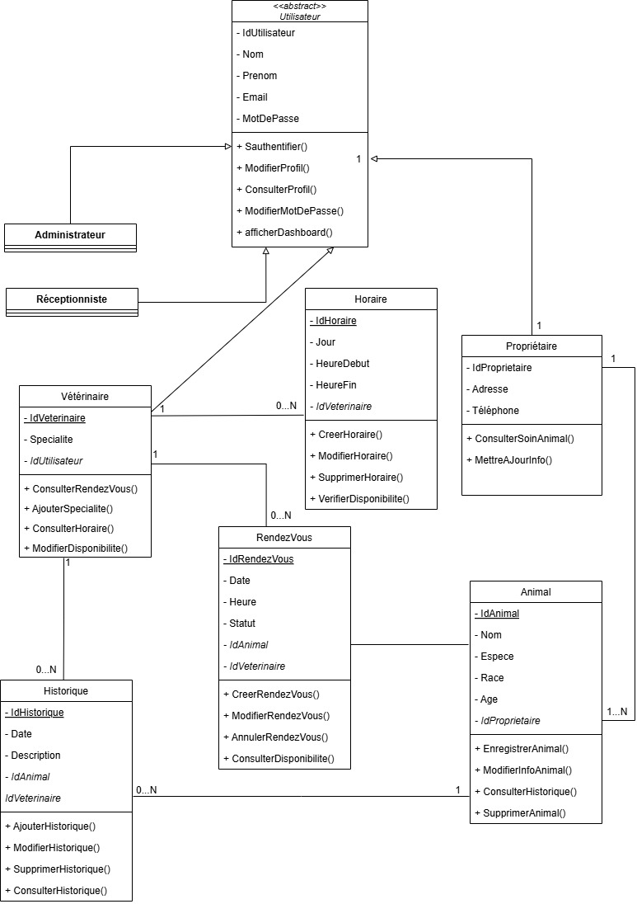
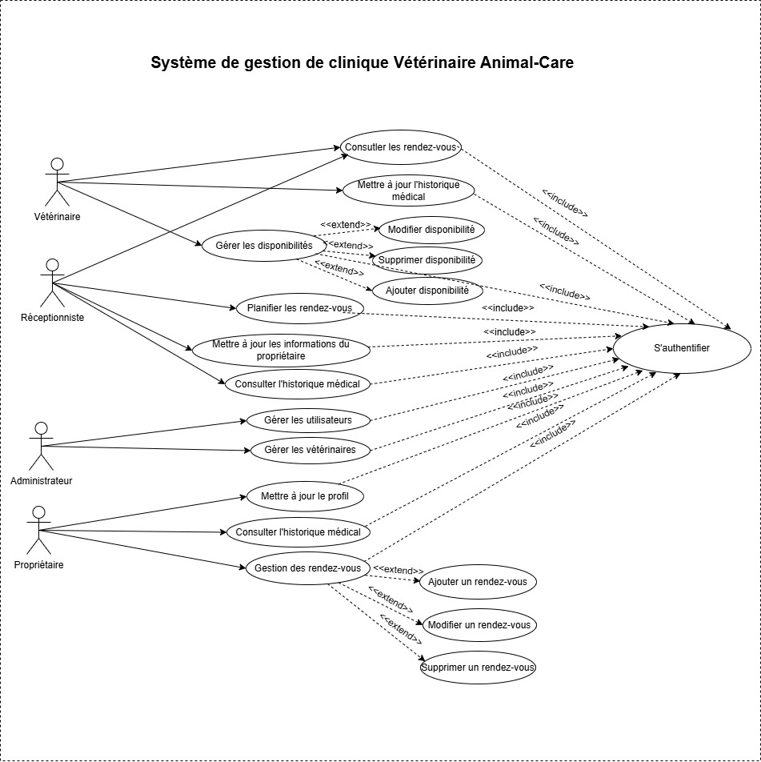

# Rapport de corrections – Projet AnimalCare

## Introduction
À la suite des commentaires reçus sur le proje plusieurs correctionss ont été faites afin de mieux respecter les exigences du cours et de rendre le projet plus clair sur le plan technique.  
Ce rapport présente de manière simple les principales tâches réalisées.

## 1. Correction de la notation UML
La notation UML a été corrigée afin de respecter les règles des notions UML.  
Les relations d’héritage ont été coorigées et les flèches ont été remplacées par des notations UML correctes.  
Certaines relations qui n’étaient pas valides ont aussi été modifiées pour rendre le diagramme plus clair et plus professionnel.

## 2. Déclaration des classes abstraites
La classes qui devait être abstraite a été identifiée.  
La classe Utilisateur a été déclarée comme classe abstraite, car elle représente une base pour plusieurs types d’utilisateurs du système.  
Cela permet de mieux représenter la hiérarchie entre les rôles comme Administrateur, Réceptionniste, Vétérinaire et Client.

## 3. Remplacement des relations UML non valides
Les relations UML non valides ont été remplacées par des relations correctes.  
Les associations et héritages ont été réorganisés pour mieux représenter le fonctionnement du projet.  
Cette correction améliore la lisibilitéet facilite la compréhension de l’architecture.

## 4. Ajout des entités métier du SRS dans le code
Les principales entités métier sont définies dans le SRS ont été ajoutées dans le code du projet.  
Cela inclut les entités suivants :

- `Utilisateur`
- `Proprietaire`
- `Animal`
- `Veterinaire`
- `RendezVous`
- `Horaire`

Cette amélioration permet d’assurer une meilleure cohérence entre la documentation du projet et son implémentation.

## 5. Ajout d'un ADR
Pour mieux documenter les décisions techniques, un ADR ont été ajouté.  
Au lieu d’avoir un seul ADR, le projet contient maintenant plus décisions importantes liées :

- au choix du type d’application
- au choix de l’architecture et des design patterns
- au choix de des données

Cela rend la documentation plus complète et montre mieux la réflexion technique derrière le projet.

### Diagramme de classes

Le diagramme de classes montre les principales classes du projet, leurs attributs, leurs méthodes ainsi que les relations entre elles.  
Il permet de visualiser l’héritage, les associations et l’organisation générale du système.

### Diagramme de cas d’utilisation

Le diagramme de cas d’utilisation montre les différents acteurs du système et les principales actions qu’ils peuvent réaliser.  
Il permet d’illustrer les fonctionnalités accessibles à chaque rôle, comme l’administrateur, la réceptionniste, le vétérinaire et le client.

## Conclusion
En résumé, les corrections apportées ont permis d’améliorer la qualité du projet sur plusieurs aspects.  
La notation UML a été corrigée, les classes abstraites ont été précisées, les principales entités métier ont été intégrées, plusieurs ADR ont été ajoutés et les diagrammes essentiels ont été inclus dans le rapport.  
Ces changements rendent le projet un plus complet et cohérent avec les attentes du cours.
